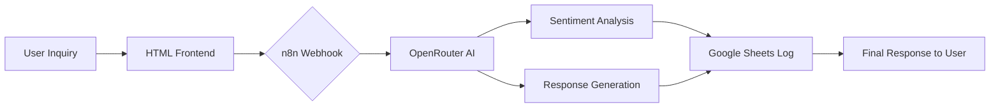

# 🚀 n8n Automation Portfolio

A collection of professional-grade **n8n** workflows, ranging from basic integrations to advanced AI-powered automation solutions. This repository demonstrates the power of low-code automation for business processes.

---

## 📂 Project Structure

- **`/projects/ai-support-bot`**: An end-to-end AI Customer Support Agent.
- **`/workflows`**:
  - `http-request.json`: API integration practice.
  - `webhook-handler.json`: Real-time trigger practice.
  - `code-transformation.json`: Custom JavaScript logic practice.

---

## 🤖 Featured Project: AI Customer Support Bot

This project automates the first line of customer support using LLMs and structured logging.

### ✨ Key Features
- **Intelligent Routing**: Categorizes inquiries (Billing, Technical, General).
- **Sentiment Analysis**: Tracks customer mood in real-time.
- **Automated Logging**: Keeps a clean record in Google Sheets.
- **Modern UI**: Includes a premium tester interface (`test.html`).

### 🛠️ Tech Stack
- **n8n**: Workflow orchestration.
- **OpenRouter (LLM)**: Intelligent response generation.
- **Google Sheets**: Persistent storage for logs.
- **Custom HTML**: A sleek, modern testing interface.

### 🔄 Workflow Architecture

---

## 🚀 Getting Started

### 1. Import Workflows
Choose a workflow to import into your n8n instance:
- **Main Project**: `projects/ai-support-bot/workflow.json`
- **Practice 1**: `workflows/http-request.json`
- **Practice 2**: `workflows/webhook-handler.json`
- **Practice 3**: `workflows/code-transformation.json`

### 2. Configure AI Bot (Featured Project)
- **API Key**: Add your **OpenRouter API Key** in the AI nodes.
- **Sheets**: Connect your **Google Sheets** account to the spreadsheet node.
- **Tester**: Update line **144** in `projects/ai-support-bot/test.html` with your test webhook URL.

---

## 📜 License
This project is licensed under the MIT License - see the [LICENSE](LICENSE) file for details.

---

## 👨‍💻 Author
**Haseeb Arif**
- GitHub: [@Haseeb Arif](https://github.com/haseebairf11)
